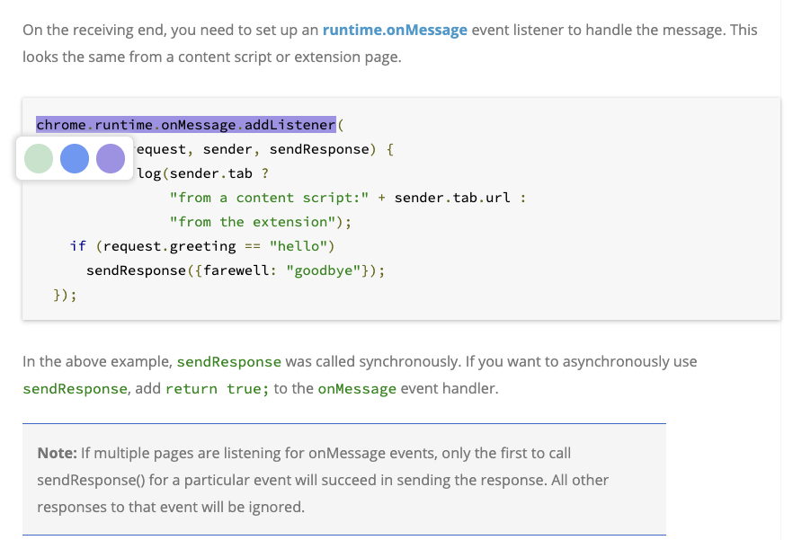

# Gohighlights Chrome Extension

Extension ID: `homlcfpinafhealhlmjkmdjdejppmmlk`

This is a frontend highlight tool for Chrome. It relies on back-end services for its synchronization capabilities.

You can deploy the service locally, see also [https://github.com/icbd/gohighlights](https://github.com/icbd/gohighlights) .

## Demo

functions:

* Add Highlight
* Change Color
* Remove Highlight
* Replay Highlight

## License

MIT, see [LICENSE](LICENSE)